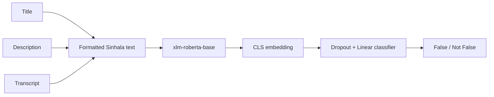

# Sinhala YouTube Consistency Detection

Research pipeline for real-world Sinhala YouTube title/description/transcript consistency detection.

Current active model:

```text
title + description + transcript + consistency features -> xlm-roberta-base -> binary classifier
```

The public labels remain `False` and `Not False`, but the active v1 meaning is consistency-based:

```text
False = title or description is not sufficiently supported by the transcript
Not False = title, description, and transcript are aligned enough
```

The image branch is temporarily disabled because the current dataset does not contain real thumbnails. Metadata fields such as `thumbnail_text`, `thumbnail_prompt`, `topic`, and `consistency_pattern` are kept only for analysis and splitting reports; they are not model inputs.

## Binary Labels

- False
- Not False

Label conversion policy:

```text
Inconsistent / clickbait / same-topic mismatch -> False
Consistent / supported metadata -> Not False
```

The model should not be reported as an external fact-checking system. It predicts whether the available transcript supports the title and description.

## Dataset

Development CSV:

```text
data/sinhala_youtube_false_content_synthetic_1000.csv
```

Real-world CSV template:

```text
data/real_sinhala_youtube_false_content_template.csv
```

Real-world schema:

```text
video_id
url
title
description
transcript
topic
original_label
binary_label
label_source
annotator_notes
group_id
```

Synthetic metrics are for development only. Real-world accuracy must be reported from a human-labeled Sinhala YouTube test set.

Legacy synthetic schema:

```text
video_id
group_id
title
description
transcript
thumbnail_text
thumbnail_prompt
label
topic
consistency_pattern
```

### Controlled hard negatives

The content-match generator includes close `Misleading`/`False` examples that keep the
category fixed while changing one decisive fact. Covered changes are person, location,
product, number, event, main topic, result or outcome, health or financial claim, and
time period. For example, a Technology title about building a Python mobile app can be
paired with a Technology transcript that only teaches Python variables.

```bash
python training/build_content_match_dataset.py --rows 10000
```

The generated CSV includes `topic` and `hard_negative_type` audit columns. They are not
model inputs. The quality report shows the distribution of hard-negative fact changes,
and generation fails if a curated pair changes category or changes undeclared fields.

## Text Input Format

The model input is built exactly as:

```text
[TITLE]
{title}

[DESCRIPTION]
{description}

[TRANSCRIPT]
{transcript}

[CONSISTENCY_FEATURES]
title_transcript_similarity=0.23
description_transcript_similarity=0.41
title_description_similarity=0.72
```

Sinhala Unicode is kept unchanged. Common English words and phrases are deterministically translated to Sinhala before similarity features are computed, and the same preprocessing is used in training, prediction, and duplicate scoring.

## Architecture



## Setup

```bash
pip install -r requirements.txt
```

## Prepare Grouped Splits

```bash
python training/prepare_data.py --input "data/sinhala_youtube_false_content_synthetic_1000.csv"
```

This uses `group_id`, not random splitting. Samples with the same `group_id` stay in one split. The target is approximately:

```text
70% train
15% validation
15% test
```

Saved files:

```text
outputs/train.csv
outputs/validation.csv
outputs/test.csv
outputs/label_mapping.json
outputs/data_summary.json
```

The script prints dataset size, label distribution, topic distribution, group count, split sizes, and leakage status.

## Train

```bash
python training/train_text_baseline.py --local-files-only
```

Defaults:

```text
epochs: 5
batch size: 8
learning rate: 2e-5
weight decay: 0.01
early stopping: enabled
mixed precision: enabled when CUDA GPU is available
optimizer: auto, using SGD on CPU and AdamW on GPU
CPU memory mode: micro-batch size 1 with gradient accumulation to effective batch size 8
```

The entire XLM-RoBERTa model is fine-tuned. Encoder layers are not frozen.

If CPU memory is still tight, explicitly run:

```bash
python training/train_text_baseline.py --local-files-only --micro-batch-size 1 --max-length 192
```

Saved model:

```text
outputs/model/
```

## Evaluate

```bash
python evaluation/evaluate_text.py --local-files-only
```

Saved outputs:

```text
outputs/metrics.json
outputs/confusion_matrix.png
outputs/classification_report.txt
```

Metrics include accuracy, precision, recall, macro F1, weighted F1, confusion matrix, and per-class metrics.

## Predict

```bash
python predict.py --title "..." --description "..." --transcript "..." --local-files-only
```

Output:

```json
{
  "predicted_label": "Not False",
  "label": "Not False",
  "confidence": 0.92,
  "class_probabilities": {
    "False": 0.08,
    "Not False": 0.92
  }
}
```

## YouTube Test Page

Start the local test server:

```cmd
run_test_server.bat
```

Then open:

```text
http://127.0.0.1:5000/test
```

`Load` fetches title, description, thumbnail, and public captions through YouTube Data API v3. If captions are missing, the page offers two explicit choices:

```text
Generate Transcript
Analyze Without Transcript
```

The app does not automatically download/transcribe every loaded video.

## Sinhala Whisper Fine-Tuning

ASR manifest template:

```text
data/sinhala_asr_manifest_template.csv
```

Required columns:

```text
audio_path
transcript
split
source
duration_seconds
```

Validate your manifest:

```bash
python training/validate_asr_manifest.py --manifest data/sinhala_asr_manifest.csv
```

Measure Whisper transcription accuracy on a human-transcribed split:

```bash
python evaluation/evaluate_whisper_sinhala.py --manifest data/sinhala_asr_manifest.csv --split test
```

This reports WER and CER and writes:

```text
outputs/whisper_sinhala_eval.json
outputs/whisper_sinhala_eval_predictions.csv
```

Fine-tune Hugging Face Whisper:

```bash
python training/train_whisper_sinhala.py --manifest data/sinhala_asr_manifest.csv --model openai/whisper-small
```

The fine-tuned model is saved under:

```text
outputs/whisper_sinhala/
```

Runtime settings:

```text
WHISPER_RUNTIME=faster_whisper|huggingface|openai_whisper|xlsr_sinhala
WHISPER_MODEL=outputs/whisper_sinhala
WHISPER_DEVICE=cpu|cuda|auto
WHISPER_COMPUTE_TYPE=int8|float16 (optional override)
WHISPER_BEAM_SIZE=5
WHISPER_CPU_THREADS=0
MAX_AUDIO_TRANSCRIPT_SECONDS=900
```

`faster_whisper` models are loaded once per server process and reused across videos.
Audio is transcribed directly from the downloaded compressed stream, avoiding an
intermediate WAV conversion. Public-caption and generated transcripts are cached by
video id. CPU with `int8` is the safe default. Set `WHISPER_DEVICE=cuda` only after
verifying the CTranslate2 CUDA/cuDNN setup; `auto` selects CUDA whenever a device is
reported and may be unsuitable for partially configured GPU environments. CUDA uses
`float16` unless `WHISPER_COMPUTE_TYPE` is explicitly set. Beam size `5` preserves the
existing decoding quality; set `WHISPER_BEAM_SIZE=1` as an optional fast mode and
validate its Sinhala WER/CER before using it for dataset labels.

## Notes

- Do not use `thumbnail_prompt`, `thumbnail_text`, `topic`, or `consistency_pattern` as model inputs.
- `topic` is used only for distribution reporting.
- The multimodal code remains in the repository for later reactivation after real thumbnails are added.

## Chrome Extension Test

The `chrome_extension/` folder contains a local Chrome extension for testing the trained model on YouTube pages.

Start the local Flask backend with the CUDA environment:

```powershell
$env:PYTHONPATH="C:\Users\User\AppData\Local\Programs\Python\Python311\Lib\site-packages"
& "C:\Users\User\torch-env\Scripts\python.exe" app.py
```

Optional YouTube Data API key for server-side title and description lookup. Create a `.env` file in the project root:

```text
YOUTUBE_API_KEY=YOUR_API_KEY
```

Or set it in PowerShell:

```powershell
$env:YOUTUBE_API_KEY="YOUR_API_KEY"
```

Load the extension:

```text
Chrome -> Extensions -> Manage extensions -> Developer mode -> Load unpacked
Select: chrome_extension/
```

Open a YouTube video and click the extension button. The extension sends the video id, page title, page description, and visible transcript text if YouTube's transcript panel is open.

The backend fetches title, description, and thumbnail from YouTube Data API when `YOUTUBE_API_KEY` is set. It also tries to fetch public caption transcripts automatically from the YouTube link. If captions are unavailable, the `/test` page can explicitly request audio transcription with Whisper.

Audio transcription requires `ffmpeg` on `PATH` and the optional packages in `requirements.txt`. The first Whisper run may download the selected model. Defaults:

```text
WHISPER_RUNTIME=faster_whisper
WHISPER_MODEL=base
WHISPER_DEVICE=cpu
WHISPER_BEAM_SIZE=5
MAX_AUDIO_TRANSCRIPT_SECONDS=900
```

Use this only for videos you are allowed to process. If no API key is configured, the backend still attempts public page metadata, thumbnail, and public captions, but descriptions are more reliable with the API key.
